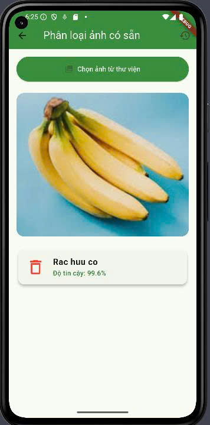
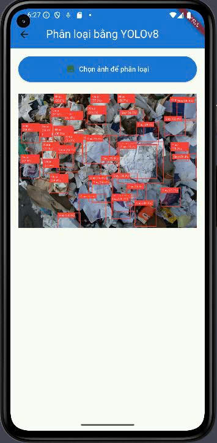
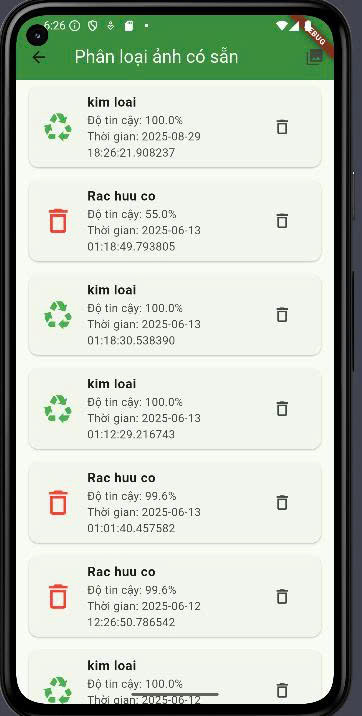
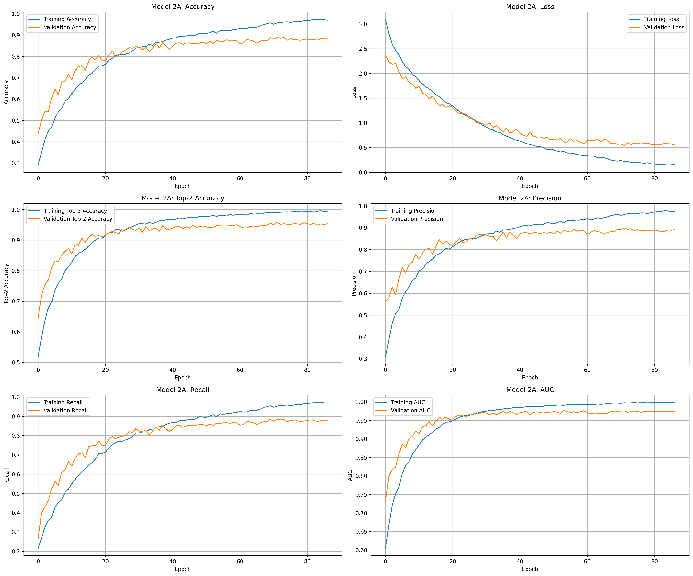
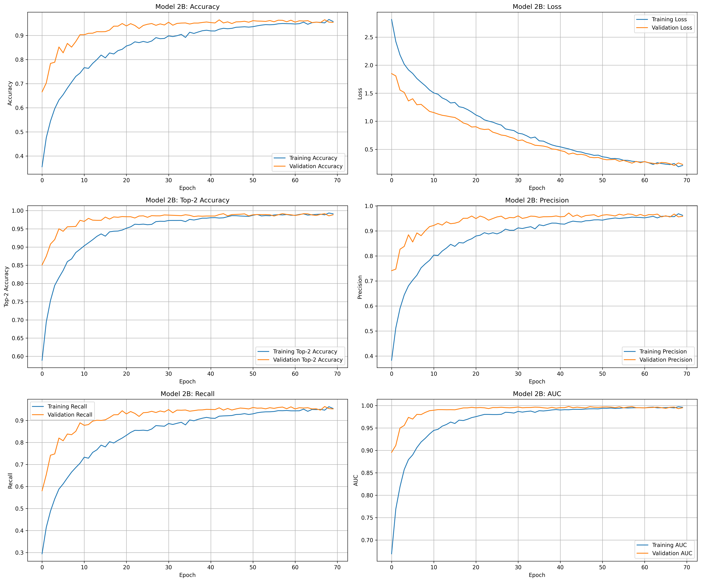

git clone https://github.com/LeNhan18/GarbageClassification.git
# README.md

## ♻️ Hệ thống phân loại rác (YOLO + EfficientNetB2)

API gồm hai chức năng:
- `/predict`: Phát hiện vật thể bằng YOLOv8
- `/classify_garbage`: Phân loại rác bằng EfficientNetB2 (2 bước)

### Ảnh minh họa





#### Training history (EfficientNetB2)



---

### ⚙️ Cài đặt môi trường (Python >= 3.8)
```bash
pip install -r requirements.txt
# hoặc:
pip install fastapi uvicorn tensorflow pillow opencv-python ultralytics pydantic
```

Biến môi trường:
- `MODEL_BASE_PATH`: thư mục chứa các model EfficientNetB2
- `YOLO_MODEL_PATH`: đường dẫn file `.pt` của YOLO
- `MAX_FILE_SIZE`: giới hạn dung lượng upload (mặc định 10MB)

Chạy server:
```bash
python -m uvicorn models.main:app --reload --host 0.0.0.0 --port 8000
```

Endpoints:
- `GET /`            – thông tin API
- `GET /health`      – trạng thái model đã load
- `POST /predict`    – YOLOv8 object detection
- `POST /classify_garbage` – EfficientNetB2 classification

Ví dụ gọi `/predict`:
```bash
curl -X POST "http://localhost:8000/predict" -F "file=@path/to/image.jpg"
```

Ví dụ gọi `/classify_garbage`:
```bash
curl -X POST "http://localhost:8000/classify_garbage" -F "file=@path/to/image.jpg"
```

---

###  Cấu trúc thư mục dữ liệu (gợi ý)
```
data/
├── binary/               # Dùng cho model1
│   ├── recyclable/
│   └── non_recyclable/
├── recyclable/           # Dùng cho model2a
│   ├── plastic/
│   ├── paper/
│   ├── metal/
│   ├── glass/
│   └── cardboard/
└── non_recyclable/       # Dùng cho model2b
    ├── trash/
    ├── battery/
    ├── clothes/
    ├── shoes/
    └── biological/
```

---

###  Các file Python chính

| File name                         | Chức năng |
|-----------------------------------|-----------|
| `models/main.py`                  | FastAPI: `/predict` (YOLO), `/classify_garbage` (EfficientNetB2) |
| `models/MainYolo.py`              | Ví dụ API YOLO độc lập |
| `models/utils.py`                 | Hỗ trợ xử lý ảnh/dữ liệu |
| `models/TrainModel1.py`           | Huấn luyện model1 |
| `models/TrainModel2.py`           | Huấn luyện model2 |
| `models/train_model1_improved.py` | Huấn luyện model1 (improved) |
| `models/predict_image.py`         | Dự đoán từ script |

---

###  Convert mô hình sang TensorFlow Lite (dùng cho Flutter)
```bash
python models/CovertTFlite.py
```

---

###  Xử lý ảnh: Đổi tên, resize
```bash
python models/utils.py
```

---

###  Gợi ý dữ liệu
- Tên folder ảnh không dùng dấu/khoảng trắng
- Resize ảnh về kích thước phù hợp (vd 224x224)
- Nên có >200 ảnh mỗi lớp

---
