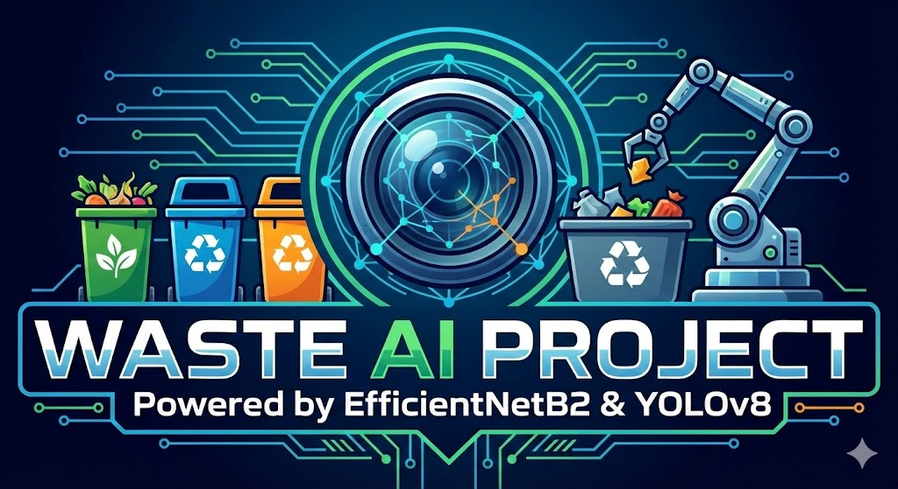
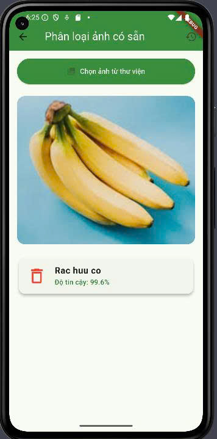
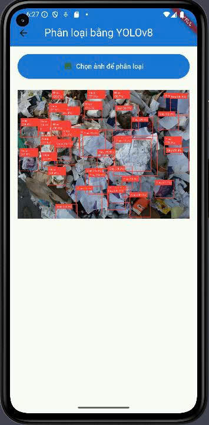
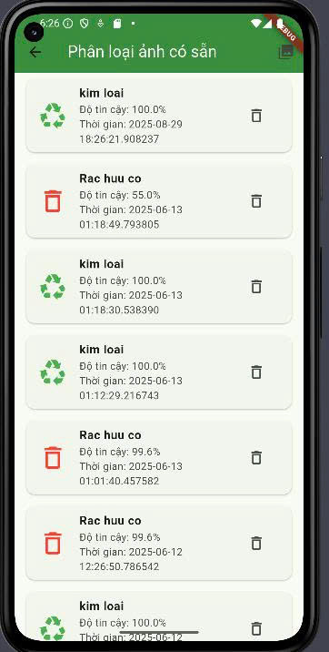
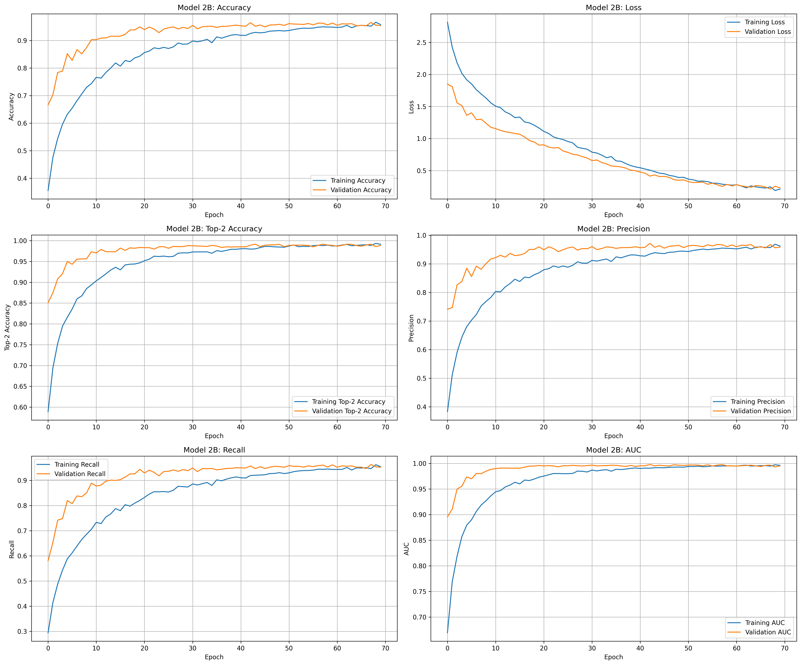
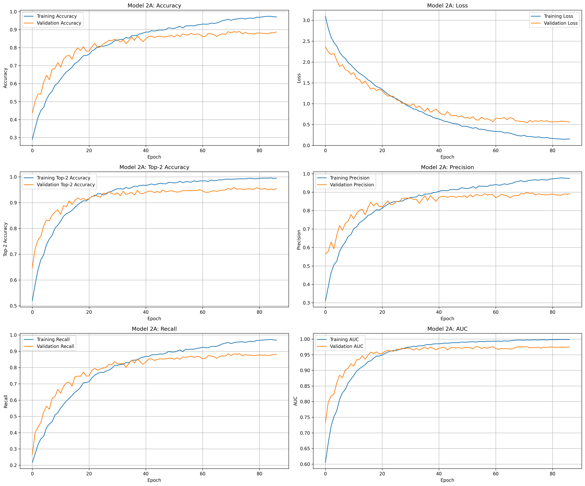

<div align="center">
  
</div>

# Garbage Classification System

An end-to-end waste classification system that combines computer vision, deep learning, and mobile deployment. The project integrates:

- YOLOv8 for object detection
- EfficientNetB2 for multi-stage waste classification
- FastAPI for backend inference services
- Flutter for cross-platform mobile access

## Table of Contents

- [1. Overview](#1-overview)
- [2. System Architecture](#2-system-architecture)
- [3. Technology Stack](#3-technology-stack)
- [4. Project Structure](#4-project-structure)
- [5. Requirements](#5-requirements)
- [6. Installation](#6-installation)
- [7. Running the Backend](#7-running-the-backend)
- [8. API Endpoints](#8-api-endpoints)
- [9. Trained Models](#9-trained-models)
- [10. Screenshots](#10-screenshots)
- [11. Model Training](#11-model-training)
- [12. Flutter App](#12-flutter-app)
- [13. Contribution Guide](#13-contribution-guide)
- [14. License](#14-license)

## 1. Overview

This project addresses real-world waste classification with a two-stage pipeline:

1. Binary classification: recyclable vs non-recyclable
2. Fine-grained classification into waste subcategories

Goals:

- Improve image classification speed and accuracy
- Support both backend and mobile integration
- Make the pipeline easy to extend with new waste categories

## 2. System Architecture

High-level pipeline:

1. A user submits an image through the API or mobile app
2. YOLOv8 optionally detects the target object in the image
3. Model 1 classifies the image as recyclable or non-recyclable
4. Model 2A or 2B performs detailed subcategory classification
5. The system returns the predicted label and confidence score

## 3. Technology Stack


## 4. Project Structure

```text
GarbageClassification/
|-- data/
|   |-- recyclable/
|   |   |-- cardboard/
|   |   |-- metal/
|   |   |-- paper/
|   |   `-- plastic/
|   `-- non_recyclable/
|       `-- trash/
|-- docs/
|-- Image/
|-- models/
|   |-- main.py
|   |-- MainYolo.py
|   |-- utils.py
|   |-- TrainModel1.py
|   |-- TrainModel2.py
|   |-- train_model1_improved.py
|   |-- predict_image.py
|   |-- predict_camera.py
|   |-- CovertTFlite.py
|   |-- logs/
|   |-- logs_EfficientNetB2/
|   |-- model/
|   `-- Model1/
|-- src/common/RecycleTrashApp/
|   |-- lib/
|   `-- android/ ios/ web/ windows/ macos/ linux/
|-- requirements.txt
`-- README.md
```

## 5. Requirements

Before running the project, make sure you have:

- Python 3.8 or later
- An up-to-date version of pip
- At least 4 GB of RAM recommended

## 6. Installation

```bash
git clone https://github.com/LeNhan18/GarbageClassification.git
cd GarbageClassification
pip install -r requirements.txt
```

Optional manual installation:

```bash
pip install fastapi uvicorn tensorflow pillow opencv-python ultralytics pydantic
```

## 7. Running the Backend

Start the FastAPI server:

```bash
python -m uvicorn models.main:app --reload --host 0.0.0.0 --port 8000
```

After startup, the following endpoints are available:

- API docs: http://localhost:8000/docs
- Health check: http://localhost:8000/health

### Environment Variables

| Variable | Description | Default |
|---|---|---|
| `MODEL_BASE_PATH` | Directory containing EfficientNetB2 models | `./models/model/` |
| `YOLO_MODEL_PATH` | Path to the YOLO `.pt` model file | `./models/yolo.pt` |
| `MAX_FILE_SIZE` | Maximum upload file size | `10MB` |

## 8. API Endpoints

| Method | Endpoint | Description |
|---|---|---|
| GET | / | Basic API information |
| GET | /health | Model loading and service health status |
| POST | /predict | YOLOv8 object detection |
| POST | /classify_garbage | Garbage classification with EfficientNetB2 |

### Example API Requests

```bash
curl -X POST "http://localhost:8000/classify_garbage" \
  -F "file=@path/to/image.jpg"
```

```bash
curl -X POST "http://localhost:8000/predict" \
  -F "file=@path/to/image.jpg"
```

## 9. Trained Models

Pretrained model files are stored in:

- models/model/model1_binary_recyclable.keras
- models/model/model1_best.keras
- models/model/model2_best.keras
- models/model/model2b_best.keras

### Hugging Face Model

Repository:
- https://huggingface.co/LeNhan18/ClassifyGarbageEfficientNetB2

Example download code:

```python
from huggingface_hub import hf_hub_download

local_path = hf_hub_download(
    repo_id="LeNhan18/ClassifyGarbageEfficientNetB2",
    filename="model.keras"
)
print(local_path)
```

## 10. Screenshots

| Main Interface | EfficientNetB2 Classification |
|:--:|:--:|
|  |  |

| YOLOv8 Detection | History View |
|:--:|:--:|
|  |  |

## 11. Model Training

Available training scripts:

```bash
python models/TrainModel1.py
python models/TrainModel2.py
python models/train_model1_improved.py
python models/Train_Model2B_ResNet.py
```

Convert a trained model to TensorFlow Lite:

```bash
python models/CovertTFlite.py
```

### Training Metrics Summary (EfficientNetB2)

The two charts below summarize the full training behavior of Model 2A and Model 2B across key metrics: Accuracy, Loss, Top-2 Accuracy, Precision, Recall, and AUC.

#### Model 2B Training Curves



#### Model 2A Training Curves



#### Professional Interpretation

- Convergence quality: Both models optimize smoothly, with steadily decreasing loss and stable validation trends, indicating healthy learning dynamics.
- Generalization behavior: Validation curves closely track training curves in early and mid epochs, then diverge moderately near later epochs, which is expected for high-capacity CNN architectures.
- Classification robustness: Precision, Recall, and AUC remain high across most epochs, reflecting strong class separation and balanced predictive behavior.
- Top-2 reliability: Top-2 Accuracy reaches a high level early and remains stable, indicating robust ranking performance for hard or near-boundary samples.
- Deployment recommendation: The models are ready for practical inference; selecting checkpoints at the best val_loss or val_auc epochs is recommended to minimize late-stage overfitting risk.

## 12. Flutter App

The mobile application is located at:

- src/common/RecycleTrashApp/

To run the Flutter app:

```bash
cd src/common/RecycleTrashApp
flutter pub get
flutter run
```

## 13. Contribution Guide

1. Fork the repository
2. Create a feature branch: `git checkout -b feature/your-feature`
3. Commit your changes: `git commit -m "feat: describe your change"`
4. Push the branch: `git push origin feature/your-feature`
5. Open a pull request

## 14. License

This project is licensed under the MIT License.
